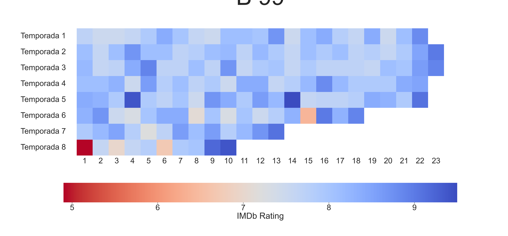
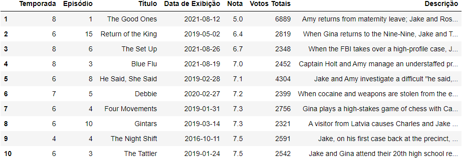
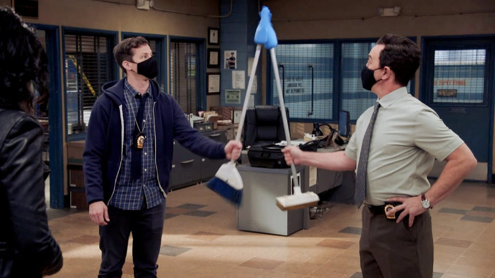
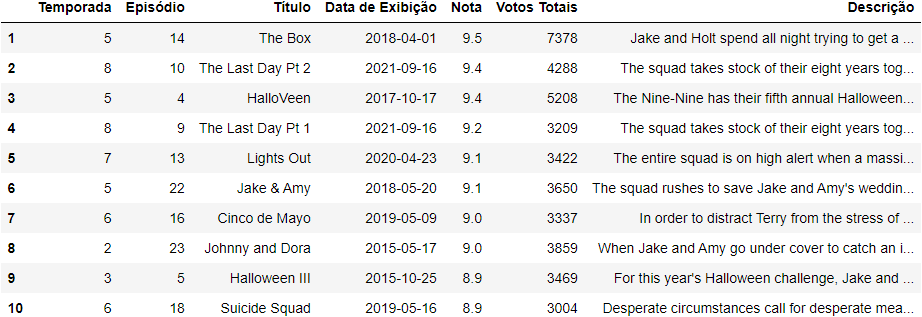

# Análise dos episódios de "Brooklyn Nine-Nine"
## Por @MatheusFarina

Este relatório coletou dados de todos os episódios de "Brooklyn Nine-Nine" utilizando um scraping do IMDB. O código foi baseado no trabalho original de @CesarGaglioni com objetivo de estudo e será atualizado e aprofundado conforme os estudos de Data Science avançarem

# Mapa de calor dos episódios

O mapa de calor dos episódios evidencia a qualidade média da série com um ponto de atenção para o episódio 1 da última temporada com uma nota extremamente baixa, o mesmo episódio foi o segundo mais avaliado.
A média da nota das temporadas segue abaixo

Temp
1    7.95
2    8.02
3    8.00
4    8.07
5    8.22
6    7.96
7    8.18
8    7.61

A menor nota fica sendo para a última temporada, o motivo proposto será discutido abaixo em mais detalhes.

A série mantém uma média de nota alta ao longo dos episódios (nota > 7) tendo apenas 3 episódios com uma nota inferior sendo eles 

S08E06 - The Set Up (6.7)

Episódio sobre excessos policiais.

S06E15 - The Return of the King (6.4)

Retorno de Gina Linetti, com proposta muito diferente do padrão da série

S08E01 - The Good Ones

Episódio pós COVID, lidando com Pandemia e Black Lives Matter.

### Trabalho em Construção